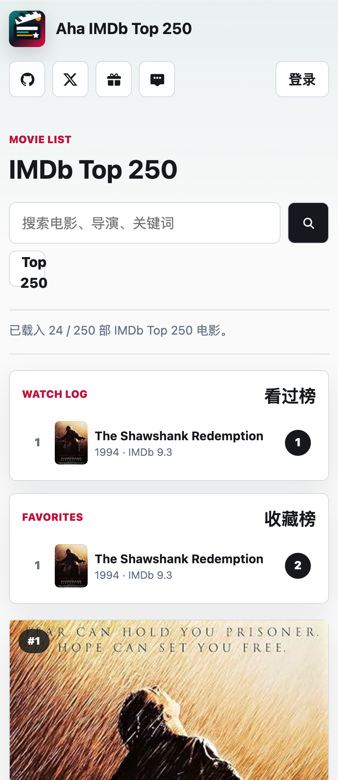

# 乔木电影清单

**中文** | [English](#english)


> 一个面向用户的电影清单网站：默认浏览 IMDb Top 250，支持搜索、详情页、看过/想看和收藏。
> A self-hosted movie guide for IMDb Top 250, with search, detail pages, watch states, and favorites.

[Live Site](https://movie.qiaomu.ai) · [License](LICENSE)

## 这是什么

乔木电影清单是乔木的中文电影清单站。用户不登录也能浏览、搜索、标记看过和想看；收藏需要注册登录。每个电影详情页提供中文片名、观影入口、口碑、创作线索和相关电影推荐。

## 核心能力

| 能力 | 用户得到什么 |
|---|---|
| IMDb Top 250 默认清单 | 打开首页即可浏览 250 部高分电影，列表懒加载分页 |
| 独立详情页 | 每部电影都有中文片名、摘要、评分口碑、主创资料和相关电影 |
| SEO 页面 | 详情页输出独立 meta、canonical、结构化数据和 sitemap |
| WebP 海报缓存 | 海报由服务端压缩为低分辨率 WebP 并持久缓存 |
| 看过 / 想看 | 游客可直接标记，方便记录观影状态 |
| 收藏 | 注册登录后收藏电影 |
| 搜索 | 可从默认榜单之外查找更多电影 |
| 移动端布局 | 手机和桌面都按正式网页宽度排版 |
| 榜单数据 | 看过榜和收藏榜接口保留，首页默认隐藏，等运营一段时间后恢复 |

## 截图



## 快速开始

```bash
pnpm install
cp .env.example .env.local
pnpm dev
```

打开 `http://127.0.0.1:4173`。

### 环境变量

```bash
OMDB_API_KEY="your-omdb-key"
SESSION_SECRET="replace-with-a-long-random-secret"
PUBLIC_BASE_URL="https://movie.qiaomu.ai"
LEGACY_HOSTS="aha.qiaomu.ai"
DEEPSEEK_API_KEY=""
DEEPSEEK_MODEL="deepseek-v4-flash"
EDITORIAL_LLM_API_KEY=""
EDITORIAL_LLM_BASE_URL="https://api.z.ai/api/coding/paas/v4"
EDITORIAL_LLM_MODEL="glm-5.2"
```

`OMDB_API_KEY` 和 `SESSION_SECRET` 是生产必需项。翻译和深度观影内容模型是可选项；没有可用 key 时，网站仍会基于电影字段展示具体资料。

## 命令

```bash
pnpm check
pnpm build
pnpm warm-cache
```

`warm-cache` 默认预热 IMDb Top 250 电影详情、深度观影内容和 WebP 海报缓存；可用 `WARM_LIMIT`、`WARM_DETAILS=0`、`WARM_POSTERS=0` 控制范围。

## 架构

| 路径 | 说明 |
|---|---|
| `public/` | 前端页面、样式、交互和图标 |
| `server/` | Node HTTP 服务、认证、电影资料、JSON 存储 |
| `server/data/top250-imdb.json` | IMDb Top 250 种子数据 |
| `storage/` | 本地运行时数据，已被 gitignore |
| `design/` | Qiaomu icon skill 生成的图标候选 |
| `docs/assets/` | README 使用的截图 |

## API

| Endpoint | 说明 |
|---|---|
| `GET /api/health` | 运行状态 |
| `GET /api/session?visitorId=...` | 当前登录、收藏和游客标记 |
| `GET /api/movies?limit=24&offset=0` | IMDb Top 250 分页 |
| `GET /api/movies?q=blade%20runner` | 电影搜索 |
| `GET /api/movies/:imdbID` | 电影详情、摘要、口碑和相关推荐 |
| `GET /api/posters/:imdbID.webp` | 服务端 WebP 海报缓存 |
| `POST /api/reactions/:imdbID` | 游客看过/想看 |
| `POST /api/favorites/:imdbID` | 登录用户收藏 |
| `GET /api/leaderboards` | 看过榜和收藏榜 |
| `GET /sitemap.xml` | 站点地图 |
| `GET /robots.txt` | 搜索引擎抓取规则 |

## 部署

这是一个带服务端状态的 Node 应用，不是纯静态站。生产部署建议：

1. 设置 `OMDB_API_KEY`、`SESSION_SECRET`、`PUBLIC_BASE_URL`。
2. 将 `STORAGE_DIR` 指向持久化目录。
3. 用 systemd / PM2 / Docker 等方式运行 `node server/index.mjs`。
4. 用 Nginx 或 Caddy 反代到公网域名。

## 限制与边界

- IMDb Top 250 种子列表以仓库内 `server/data/top250-imdb.json` 为准，需要定期更新。
- 电影资料受第三方接口配额和字段可用性影响。
- 当前存储是 JSON 文件，适合轻量个人站；高并发生产环境建议换成 SQLite/Postgres。
- 第三方电影资料和海报版权归原权利方所有。

## 关于向阳乔木

- Website: https://qiaomu.ai
- Blog: https://blog.qiaomu.ai
- 推荐站: https://tuijian.qiaomu.ai
- X: https://x.com/vista8
- GitHub: https://github.com/joeseesun
- 微信公众号：向阳乔木推荐看

---

<a name="english"></a>

# English

Qiaomu Movie List is a small self-hosted movie guide for Qiaomu sites. It starts from an IMDb Top 250 seed list and provides search, detail pages, watch states, favorites, and leaderboards.

Users can browse and search without signing in. Watch-state actions are available to visitors; favorites require registration.

## Quick Start

```bash
pnpm install
cp .env.example .env.local
pnpm dev
```

Open `http://127.0.0.1:4173`.

## Verification

Run:

```bash
pnpm check
```

## License

MIT. Third-party movie metadata and poster rights remain with their original owners.
